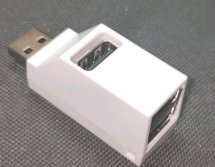
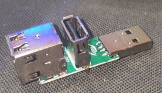
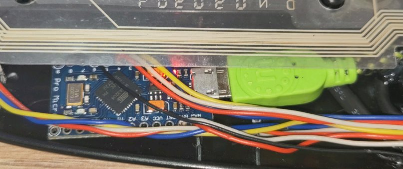
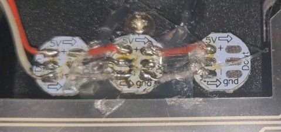
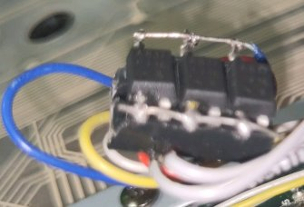

# KeyboardMod

This program is for a Keyboard modification which consists of replacing the normal (normally 3) keyboard leds by addressable RGB leds.
The original led outputs of the keyboard are instead used as input for the arduino (using simple optocouplers).
This still allows to read and display the original status from the keyboard, but you can freely set the colors used.

I inserted a USB hub circuit board extracted from the smallest USB hub I could find. So I can program and communicate with the arduino using the 
normal USB cable from the keyboard. 

The communication works over normal UART, currently at baud rate 9600.  
It accepts the following comands with <LED_NAME> replaced by the name of the led you want to access and <COLOR> replaced by a 24 bit hex number
(e.g. FF00FF) with always two hex characters being one color in the order R G B.

```
// Set the current color.
<LED_NAME> <COLOR>
// e.g.
// NUM 0000FF
// sets the color of the numlock led to blue

// Set the color used when the keyboard triggers the led. Enables the override mode.
// In this mode the led can be controlled by the keyboard itself and override the manually set color.
<LED_NAME> override <COLOR>
// e.g.
// NUM override 0000FF
// Sets the color of the numlock led to blue if the keyboard wants to enable it. 

// Disable the abillity of the keyboard to override the set color.
<LED_NAME> disable override
// e.g.
// NUM disable override
```

The response starts always with `OK: ` or `ERR: ` to indicate if the command was understood.

# Hardware

As all keyboards are different, there is no "one way", but for mine (an old Logitech Media Keyboard 600), I used the following:
* An USB 2.0 Hub with a small pcb. I searched on amazon until I found this one. (the original link is down, but you may be able to find similar ones, e.g. [this one](https://www.amazon.de/ZHITING-Spliter-Adapter-Portable-Transfer/dp/B09L821NRH/ref=sr_1_26?__mk_de_DE=%C3%85M%C3%85%C5%BD%C3%95%C3%91&crid=186GPUQ3481I1&keywords=perfk+USB+2.0+Ports+Splitter+Adapter+Hub&qid=1682258382&s=computers&sprefix=perfk+usb+2.0+ports+splitter+adapter+hub%2Ccomputers%2C68&sr=1-26))  
     
* A small arduino. I used an Arduino Pro Micro.  
    
* 3 (or more) single WS2812B RGB leds. I usually use some from BTF-LIGHTING on amazon, but any compatible brand will do.  
    
* 3 (or more) optocouplers to get the signal of the original led outputs of the keyboard. I used the [A817](https://www.datasheet4u.com/datasheet-pdf/FairchildSemiconductor/A817/pdf.php?id=703678).  
    
* (optional - you could solder directly) 6-pin socket for the optocouplers
* 3-pin socket for the leds and 6-pin socket for the arduino.

# Wiring
The basic idea is to replace the existing leds with the optocouplers, to send a signal to the arduino when the keyboard wants to enable an led.
Then the arduino can control the new rgb leds directly.

Also because the USB-Hub has an additional output, I just added a new USB port to the keyboard. However as I only work with USB 2.0 and I have to power the keyboard and arduino with it, the USB port cannot handle high current. For simple USB sticks it is enough.

## Diagram
TODO